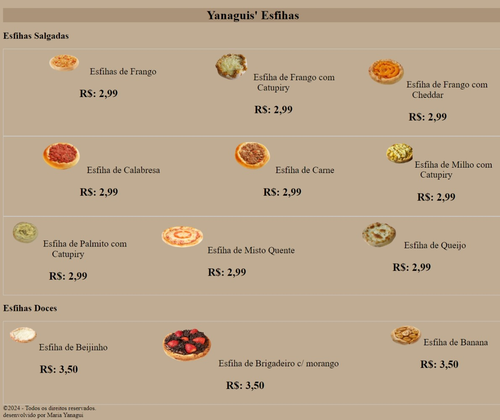

# CARDÁPIO  

🚀 COMEÇANDO
* O cardápio digital é utilizado pelos clientes que não comparecem aos restaurantes e acabam não tendo acesso ao cardápio físico para consultar quais comidas estão no menu, também se encontra o número do telefone fixo e o do WhatsApp do estabelicimento para entrarem em contato.

